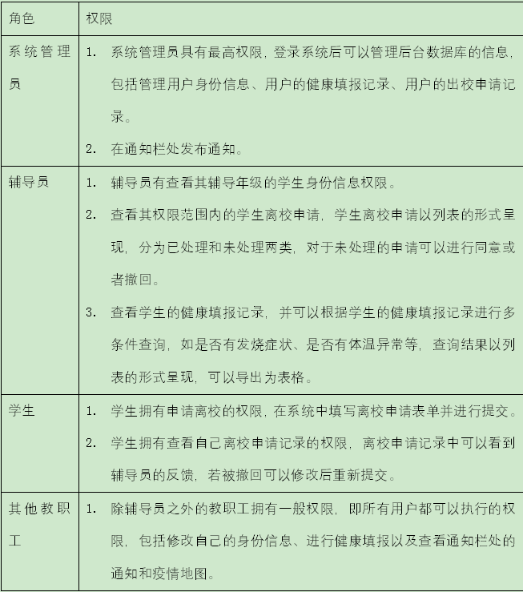
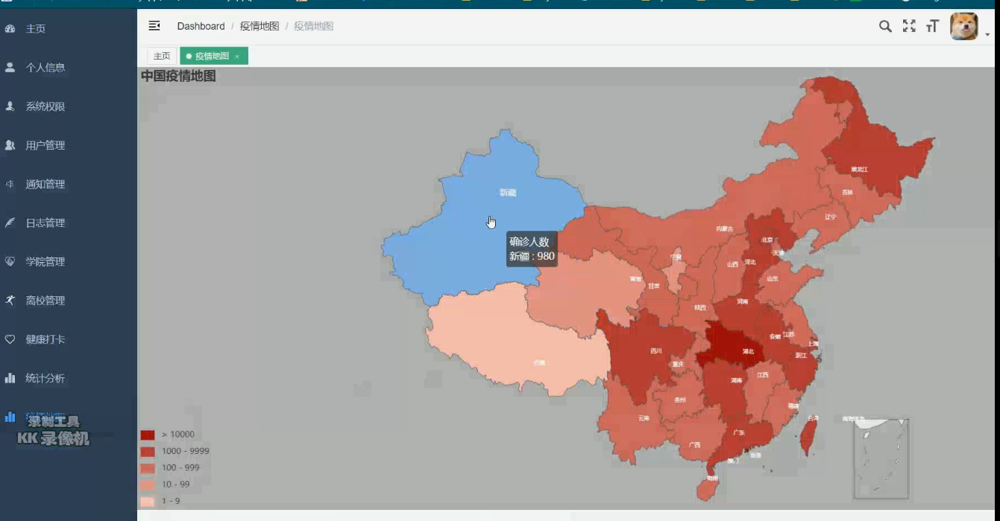
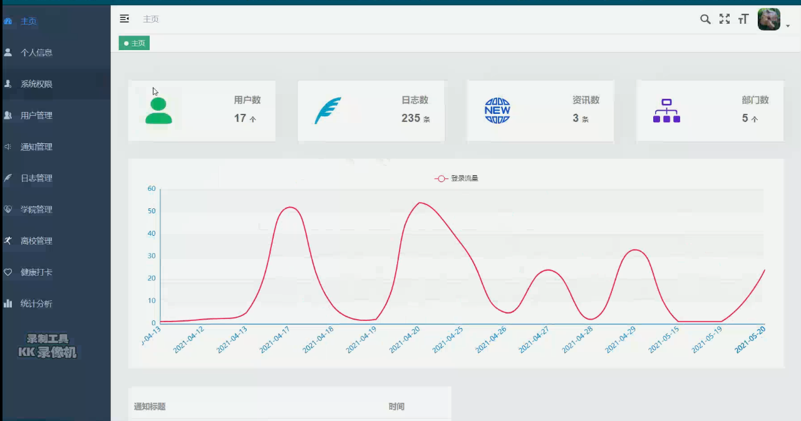
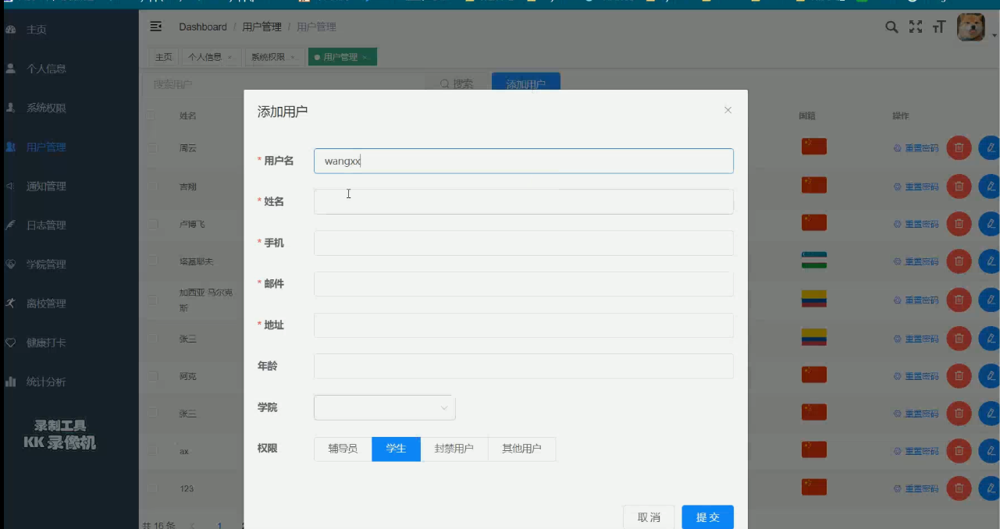
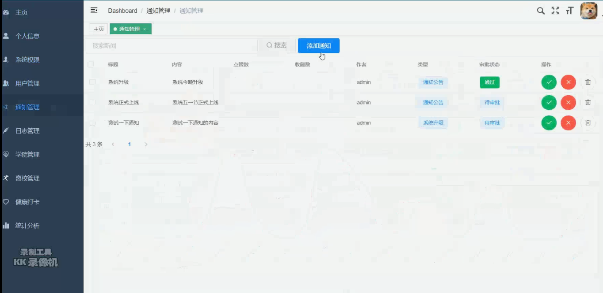
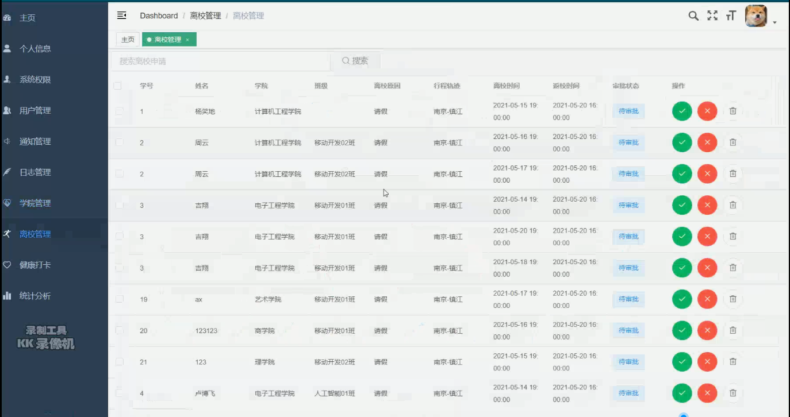
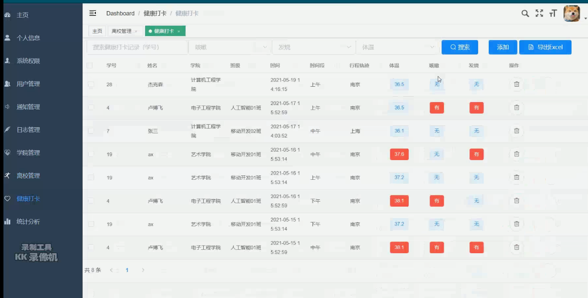
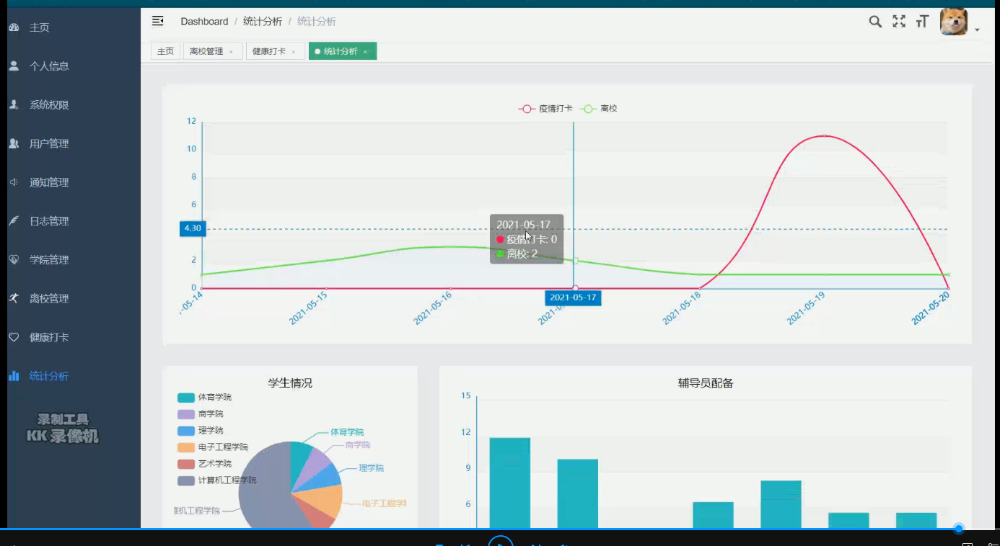
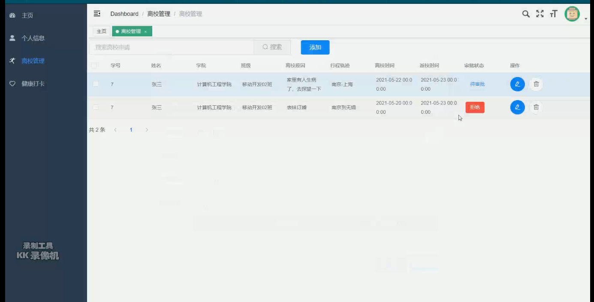

# 计算机毕业设计之SpringBoot+Vue.js校园疫情防控平台系统

源码一套有偿(论文 开题报告  文献综述  源码+sql脚本)
加好友前帮忙start一下，并备注github有偿获取源码
我的QQ号是2877135669或者2827724252
加qq好友说明（被部分 网友整得心力交瘁）：
    1.加好友务必按照格式备注
    2.避免浪费各自的时间！
    3.当“客服”不容易，repo 主是体面人，不爆粗，性格好，文明人。

https://www.bilibili.com/video/BV1gK4y1G7Bn?spm_id_from=333.999.0.0

## 功能

1.角色以及对应的权限

2.登录功能

输入用户ID和密码登录，学生ID为学号，教职工（包括辅导员）的ID为教职工号，管理员ID任意，ID为一串数字。

3.每日健康填报功能：

3.1所有用户均可进行每日健康填报。每日健康填报的内容为三次体温登记（分别为早、中、晚），行程轨迹，是否有咳嗽、发烧等症状。

3.2辅导员可以查看以及管理年级的学生的填报内容。并可以查询是否有体温异常（>37.3）或者有咳嗽、发烧症状的学生。

3.3学校管理员可以查看所有用户的填报记录，并可以查询是否有体温异常或者有咳嗽、发烧症状的人员。

3.4所有用户可以查看自己填报的历史记录。

4.离校申请功能：

4.1 学生离校时需要进行离校申请，具体流程为：

（1）学生登入系统填报信息，信息包括：离校原因、出校时间、返校时间、离校行程轨迹。

（2）辅导员审核，查看学生申请单并在申请单下面的建议框填写建议，进行同意或者不同意撤回。若学生的申请单被撤回，学生可以在原来的申请单中修改内容再次提交，此时辅导员看到的申请单包含历史建议，并且可以重新填写建议。

4.2管理员可以看到所有学生的离校申请记录。

5通知栏功能：

5.1 管理员发布通知，通知具体信息有标题、内容（可以插入图片、表格，此功能如果比较复杂可以简化为只有文字）、发布通知人、时间。

5.2 所有用户可以查看通知。

6疫情地图功能：

6.1用echarts、python实现中国疫情地图就行。有现有确诊和累计确诊，如果时间不够只需要展示现有确诊的疫情地图，并且在疫情地图的上面展示数据如：

（我本来想法是用python爬取百度疫情数据或者丁香医生网站获取这些数据，然后用echarts设计一个疫情地图）

7账号管理功能：

7.1管理员可以添加用户，学生用户信息包括：学号，姓名，电话，邮箱，通讯地址，院系，班级，登录密码（默认000000），照片（默认空白）。教职工用户信息包括：教职工号，姓名，电话，邮箱，通讯地址，所属部门/院系，登录密码（默认000000），照片（默认空白）。

7.2其他用户可以修改账户信息，只可以修改电话、邮箱、通讯地址、登录密码、照片。

# 技术

前端：vue.js elementUI echarts

后端：springboot mybatis

数据库：mysql

​	

# 运行截图

# 运行视频B站
https://www.bilibili.com/video/BV1gK4y1G7Bn?spm_id_from=333.999.0.0

